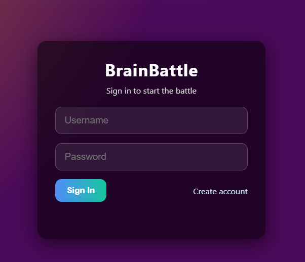
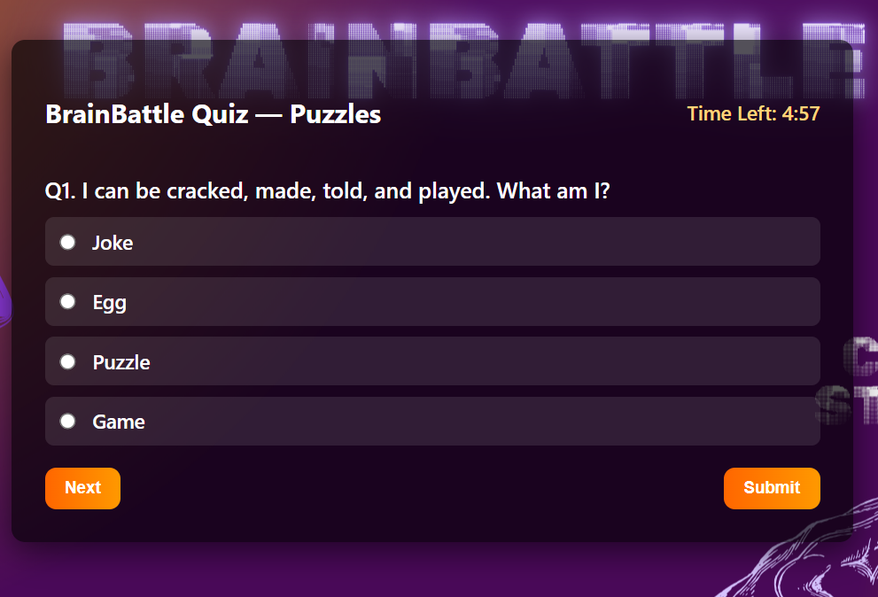

Quiz Management System

Overview :

A Java-based quiz management web application allowing users to register, log in, attempt quizzes, and view results.

Technologies Used :

- Java
- JSP
- Servlets
- JDBC
- MySQL
- HTML
- CSS
- JavaScript

Features :

- User Registration
- User Authentication
- Quiz Management
- Automatic Score Calculation
- Result Generation

Screenshots :

Login Page :

Dashboard :

Quiz Page :

Result Page :

Demo Video :

The demo video is available in the Demo folder.
